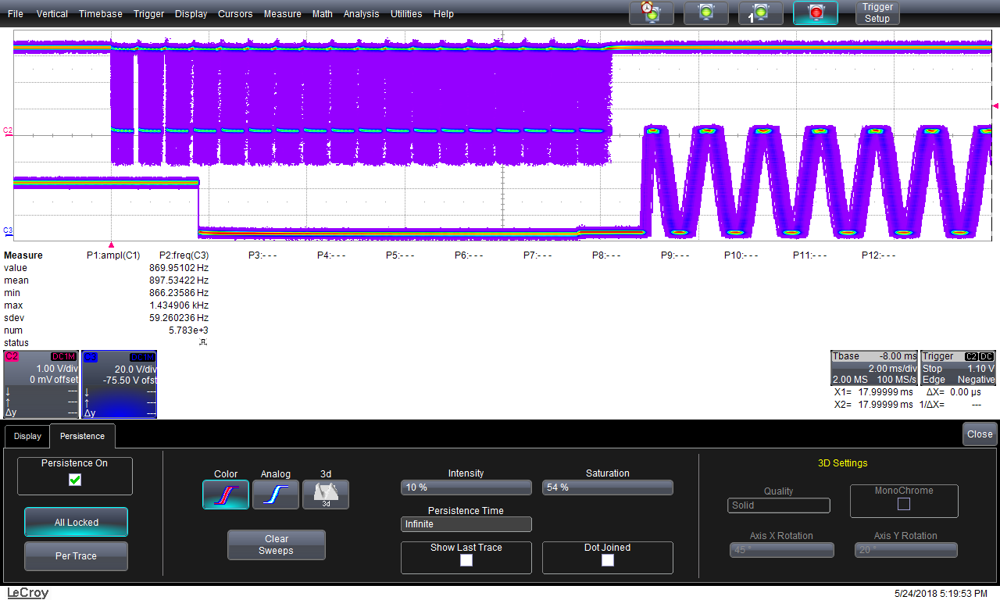

# MRI_Stimulator
David Somers (somers@bu.edu) in Psychological & Brain Sciences

## Set ups
As of: 11/6/19

| PiHat Number | Setup | History |
| ----- ------ | ----- | ------- |
| 103 | Non MRI | Replaced with new Raspberry Pi |
| 101 | MRI | Replaced with new Raspberry Pi |

Notes:

Both 101 and 103 were taken out of their setups that Abigail Noyce brought over on 11/1/19. We're putting 101 back in the MRI one and 103 in the non MRI but we're not completely sure if that was the way she brought it in.

## Final Design
Current Draws

| Operation | Current |
| --------- | ------- |
| No Buzz | ~400mA |
| Buzz all 5 | ~4A |

Resistance from the 5 female connectors that connect to the 5 male connectors on the PiHat are

| Wire | Resistance |
| ---- | ---------- |
| GND | ~5.5 Ohms |
| BST | ~10.8 Ohms |
| SIG | ~10.8 Ohms |

These resistances are the same for all 5 (15 connections) connectors (and they should be).

## How to make SD Card with Raspbian + software + initialization script
If you have a used SD card:

Plug it in to your machine.

Type

$ dmesg

to figure out the name of the partitions that the SD card has. I had a used card with 2 partitions, sdf1 and sdf2, located at /dev/sdf1 and /dev/sdf2. Most likely linux will automatically mount your partitions so you have to
unmount them. I used

$ sudo umount /dev/sdf1

$ sudo umount /dev/sdf2

Now to delete these partitions you type

$ sudo fdisk /dev/sdf

Notice I typed the device name (sdf) and not the partitions. Linux will most likely automatically mount the partitions again. You have to unmount it again in another terminal or if file managers pop up and there's an eject button somewhere, click it. Now to list all fdisk commands use

$ m

To delete the partitions type

$ d

It will ask which partition you want to delete, I just put

$ 1

for the first one and typed

$ d

again which automatically deleted the second partition since it was the only partition left. Now use

$ w

to write the changes.

If you have an unused SD card you can ignore all the previous steps (except plugging in the SD card to your machine).

To install raspbian go to https://www.raspberrypi.org/downloads/raspbian/. I downloaded the zip file for Buster with Desktop. Unzip it with

$ unzip <path/to/your/file/file.zip>

Or, on Linux, just go to the file manager and right click the zip file then click extract. After the extraction which takes a few minutes, to copy the extracted image onto the SD card, you can follow the instructions on the Linux installation guide https://www.raspberrypi.org/documentation/installation/installing-images/linux.md. Guides for other operating systems are at https://www.raspberrypi.org/documentation/installation/installing-images/README.md. Now the only necessary command from the Linux guide that I used was

$ dd bs=4M if=2019-09-26-raspbian-buster.img of=/dev/sdX conv=fsync

under "Copying the image to the SD card" on the Linux guide. *Note what the instructions under this subsection says: Do not use the wrong device (sdX) or all your hard drive information could be lost.* Under "Optional: checking whether the image was correctly written to the SD card" on the Linux guide you can find instructions for checking if the image was properly copied.

For software:

Once you have Raspbian on an SD card, plug it in and mount it to a directory, /mnt (for example). Again if you have Linux it will probably automatically mount it so unmount it first. Then mount the only partition on the SD card to /mnt. Go into /mnt/home/pi, make a directory called work and check out RevA of the mri-stimulator code which can be found here http://gauss.bu.edu/svn/mri-stimulator/software/tags/RevA/

$ cd /mnt/home/pi

$ mkdir work

$ cd work

$ svn co http://gauss.bu.edu/svn/mri-stimulator/software/tags/RevA/ software

## Evolving Design

 * 5 channel Pi Hat PCB:  http://gauss.bu.edu/svn/mri-stimulator/piezo5ch/
   * [DesignNotesRevB](DesignNotesRevB.md) *THESE DID NOT GET FIXED IN REV C*
 * Inductor board:  [PiezoInductorBoards](PiezoInductorBoards.md)
 * Document: http://gauss.bu.edu/svn/mri-stimulator/Docs/PiezoElectronicsSystem.pdf
 * cable candidates (need 10 pairs - oops!, only a few m)
   * 3M 3644B/20 (10 pair, foil + braid shield)  maybe strip off shield and re-jacket for short run out of MRI? (Digi-Key 3M155928-100-ND)
 * Inductors: 1812CS-332 (need 60 per hand so 120+)
 * DB-25 PCB mount Digi-Key A2098-ND
 * Enclosure 1591TSBK (for DB-25 transition)

 * [Cable Wiring](http://gauss.bu.edu/svn/mri-stimulator/Docs/cable_wiring.pdf) for DB-25 connectors


## Shopping List

 * ESB30K-ND (heat shrink cap)
 * 3600B/24 100SF cable (12 pairs, braid+foil shield)

 * New board:  PiezoDriverPiHat

Cast:
 * Sean Tobine (sp? 4th year GS)
 * Christopher Moore (with Brown U collaborator)
 * Michael Beauchamp (Texas)

```
 Tactical stimulator (5 fingers, piezo) for use in MRI (3T field)
 BNC cables to feed-thru (2 BNC per piezo) or alternatively DB-25
 MATLAB libraries on Mac for control ("psych toolbox" library)
 Freq, time stimulus, order ms or 10's ms resolution
 Essentially they want a menu of 4-5 different freqs for use
 within an experimental run.
```

Parts:

 * http://www.piezo.com
   * Q220-A4-503YB (large)
   * Q220-A4-203YB (small)
 * http://www.noliac.com/
   * CMBP01 (2x110 nF)
   * CMBP02 (2x220 nF)
 * DRV2700 driver chip from TI (also DRV2700EVM eval module)

*DRV2700 Design Notes*

Output is 105V max without a booster, while the piezos we're considering are 200V max.


## Debug Log
*2020-01-24 Felex*

Switched out the 3rd piezo in the non-MRI setup (aka "behavioral empanada" with PiHAT 103 (see 2020-01-23 Felex)) with spare piezo. This new 3rd piezo does not exhibit the erratic behavior of the old 3rd piezo (see 2020-01-23 Felex) and in fact exhibits the same behavior as all the other piezos (see 2020-01-23 Felex).

At this point we consider the problem fixed and are contacting David Somers' group to give them back the non-MRI setup.

*2020-01-23 Felex*

Took all 5 piezos of the non-MRI setup (aka "behavioral empanada" with PiHAT 103) along with spare piezo and buzzed on all 5 channels (30 combinations). Piezos 1, 2, 4, 5, and spare exhibited the same behavior across all channels (25 combinations). They drew the same amount of current (~0.96A) and displayed the same boost and signal voltages on the oscilloscope.

Piezo 3 exhibited very erratic behavior. Sometimes it drew 0.96A sometimes 0.74A and sometimes it displayed the same boost and signal voltage graphs as the other piezos, sometimes different graphs.

## Development Log

*2019-03-28 First Setup Debug & Testing *

The original clinical setup was returned with a vague description that one of the channels didn't work. The issue was determined to be a faulty i2c line on channel 1 of the board. The solution was to replace the old board (#004) with one from the new batch (#103).

Two notes:
1. We could equally have simply switched the connection on channel 1 to channel 3, but that would involve procedural changes to the operation of the system, namely aliasing 1 to 3 in one single command on one version of the software (too clumsy) or asking the operator to use only channels 2-5.
2. While running these tests I (Hugo) found that the newest versions of the software (r 199) is not fully functional. It would behoove us to scrutinize the code with a bench setup before installing it on any other versions. The error I noticed is that the setup command will not survive passage from the client to the host.

*2019-03-11 Hugo Cable Assembly testing *
The whole setup, using board 101 and the D-sub cable assembly to connect to the hand cradle, was tested channel by channel, and the test confirmed that everything down the signal path from the HAT board works properly.

Test steps:
 * Turn on each boost individually, turning off after testing
 * Test channels one by one
   * Set up channel 1 for paramaters at 0x20 Amplitude
   * Buzz channel 1
   * Repeat at 0x80 amplitude
   * Repeat at 0xff amplitude
   * Quit channel
   * Repeat for channels 2-5
 * Shutdown system safely with
```
shutdown -h now
```


*2019-03 Hugo HW Testing*
Testing Rev. C driver boards from a new run, numbered 101, 102, 103.
 * PWR-GND is open-circuit
 * Set supply to 5V0, 3A limits

Normal Current draws:

| Buzz Amp | Current |
| ---- --- | ------- |
| No Buzz | 430 mA |
| 0x20 | 560mA |
| 0x80 | 880 mA|
| 0xff | 1.08 A |

Board 101:
 * Powered on draws 0A current, in constant voltage at 5V0
 * On pi, it takes 400mA, 5V at bootup.
 * Passed i2c test
 * All 5 boost converters turn on to 105V
 * Channel 2 shorted with RPi GND & restarted RPi
 * Board seems to have survived

Board 102:
 * Powers on with RPi, draws normal 430mA
 * Passed i2c test
 * Current draws seem normal

Board 103:
 * Powers on with RPi, draws normal 430mA
 * 40k resistance between 5V and GND
 * Passed i2c test
 * Normal current draws for all 5 piezo channels

*2018-12-12 Final testing*
The device finalized on 12/12 takes around 3.5A to run all five channels at maximum amplitude.


*2018-11-28 Further Testing*
Several tests were conducted with the new adapter (proper pinout). The power supply had been set to a limit of 1A, and was raised to 4A, which solved the Over-Current Trip. Some notable happenings:
Testing the New device (has not been to the Somers Lab) versus the Old (Has sat in the Somers Lab) device revealed that the Old device draws about 0.1A more than does the new device.
The Old Device with the Old (Blue-box/earlier shipment) piezos produced a louder and cleaner sound than did the New device.
With the lower power supply current limit, both devices trip at relatively low levels (0x80 - 0xc0 on the hex output scale)
With the higher power supply current limit, neither device trips.

*2018-11-28 Findings*

The 4-pin to 3-pin adapter used previously in testing has a different pinout than the Piezo Inductor Board used in the setup:
 * The Piezo Inductor Board uses the pinout:   SIG,GND,BST
 * The 4-pin to 3-pin adapter used the pinout: GND,SIG,BST  ( GND and SIG are switched )
 * Three old-batch piezos, previously installed in a fully working setup (tested in MRI), are wired with pinout: SIG,GND,BST
   * These piezos have been labeled today as A, B, and C.
 * Two new-batch piezos, labeled today as D and E, are wired with pinout: GND,SIG,BST
 * One new-batch piezo, labeled today as F, is wired correctly for the 4-pin driver board outputs: GND,SIG,NC,BST

Therefore, it is suspected that GND and SIG were wired incorrectly during previous testing.

A new 4-pin to 3-pin adapter has been made with the pinout: SIG,GND,BST (in agreement with Piezo Inductor Board Rev.A)
New-batch piezos D and E will be rewired to this pinout, and tests will be repeated for all six piezos.

*2018-09-26 Test*

Conducted another test with the piezo wires closely braided.  No problems this time.  For Sean's use, the current setup is thought to be usable.

To-Do list for future systems:

 * Cable clamps to strain relief piezo wires on lid/box near header
 * Clamp or otherwise attach piezo wires to finger/thumb holders
 * Design and fabricate a housing for the in-line inductor board
 * Add a small fan to the Raspberry Pi box
 * Change long cable connector to non-magnetic one (connector housing??)
 * Design better cover for inductor board on piezo stimulator

*2018-09-05 Test*

Tested the setup in the MRI for the first time.  Thumb piezo arced.  Wires to piezo were not twisted or otherwise dressed.  It is likely the thumb wire had a significant loop which picked up RF, causing the arc.

*2018-06-19 Meeting*

Conclusions:

 * The SIF will make an initial mechanical prototype of the piezo holder, with the following mods:
   * Extend the back portion by about 3 inches beyond the most rearward position of the movable piezo holders
   * Add an array of holes on 1/2 in centers for cable ties, etc
 * The EDF (Hugo) will wire a cable with (4) piezos on one end and connectors suitable for the electronics on the other end.
 * David Somers will put his undergrad working on software in direct contact with Hugo

*2018-06-13*

We figured out some more scripting today - changing parameters of one, multiple, or all drivers and buzzing separately is possible.

Setting both two 440Hz and buzzing immediately:


Setting both two 880Hz and buzzing immediately:


Setting up all channels separately then buzzing:


after setup, changing frequency and duration of each channel individually:


Additionally, the piezo drivers have been shown to be capable of operating at the same time:


The four write blocks are writing to four different channels - the maximum amount of writing to be done on the board after setup. Two channels are hooked up to the scope - one receiving 120Hz as its frequency directive and the other 60Hz. Each write could be off by up to 2%, as the driver chip

*2018-05-29*

We wrote code that pre-programs the RAM and calls on it to play prewritten waveforms There is roughly a 1ms delay between selecting a waveform and playing it on the piezo, as shown below.


Thus we can expect a 2ms delay before buzzing should we also write to select a mux before selecting and writing to the piezo driver.

*2018-05-25*

Below is a block of the code from Chris Black at Brown with comments added to explain how the code writes to the RAM and how to write waveforms.

```
    # Control
    drv.write_byte_data(DRV_ADDRESS, 0x02, 0x00) # Write STANDBY to off, meaning writes are enabled HL
    drv.write_byte_data(DRV_ADDRESS, 0x01, _DIGITAL_GAIN_[gain]) # Writes gain value of 50 V; should write bits 6:3 as all high for CHIPID HL
    drv.write_byte_data(DRV_ADDRESS, 0x03, 0x01) # Upon seeing of the GO bit, play waveform ID 0x01 HL
    drv.write_byte_data(DRV_ADDRESS, 0x04, 0x00) # Writes null to 0x04 s.t. after 0x01 piezo stops  HL

    # Header
    drv.write_byte_data(DRV_ADDRESS, 0xFF, 0x01) # Opens RAM for writing                            HL
    drv.write_byte_data(DRV_ADDRESS, 0x00, 0x05) # Declares header to be size 5*5+1=26              HL
    drv.write_byte_data(DRV_ADDRESS, 0x01, 0x80) # Start address upper byte, basically mode + page
    drv.write_byte_data(DRV_ADDRESS, 0x02, 0x06) # Start address lower byte, start position on page
    drv.write_byte_data(DRV_ADDRESS, 0x03, 0x00) # Stop address upper byte, page number
    drv.write_byte_data(DRV_ADDRESS, 0x04, 0x09) # Stop address lower byte, end position on page
    drv.write_byte_data(DRV_ADDRESS, 0x05, 0x01) # Repeat number for waveform

    # Data
    drv.write_byte_data(DRV_ADDRESS, 0x06, amp)  # RAM waveforms stored in order Amplitude          HL
    drv.write_byte_data(DRV_ADDRESS, 0x07, freq) #                               Frequency          HL
    drv.write_byte_data(DRV_ADDRESS, 0x08, dur)  #                               Duration           HL
    drv.write_byte_data(DRV_ADDRESS, 0x09, env)  #                               Envelope           HL

    # Control
    drv.write_byte_data(DRV_ADDRESS, 0xFF, 0x00) # Exits RAM writing mode and sets to control mode  HL
    drv.write_byte_data(DRV_ADDRESS, 0x02, 0x01) # Writes 0x01 to ctrl; boost off and writes GO hi  HL

```


*2018-05-24*

The first image is the buzz signal (measured on a scope and not attached to a piezo) as it appears the first time after the function is called. For some reason the runtime is longer than the individual time (end of last i2c transaction to first buzz) by anything from 1-10ms.

These timing diagrams affirm that the delay due to i2c transactions is on the order of 10ms for a normal-sized command.


The second buzz after the function call (and subsequent buzzes) take less time (on the order of 0.1ms=100us).


Below is an image of a non-initial buzz triggering on the Out signal as opposed to the I2C lines


The following two images show delays of 700us and 11ms between the first write and the first buzz, depending on whether or not the waveform gets rewritten before each buzz GO write.




*2018-05-23*
Some messy code is written and the piezo board is up and running.
The time separation between the beginning of a GO write and the buzzing of the piezo is 0.54ms (536us), as displayed in the image below:


*2018-05-17*

Meeting yesterday.  Proposed plan:

 * DB-25 connector feed-thru the patch panel
 * Multi-conductor shielded cable with 3 wires min per piezo (better two twisted pairs per) so total 4x5 = 20 cond plus shield
 * Connector like 39-01-2200 or similar on the MRI end

*2018-05-01*

*ECOs*
 * J1 wrong pitch OK HL
 * 603 pad, 402 component: R28 R33 R38 R43 R48; R29 R34 R39 R44 R49; R30 R35 R40 R45 R50 OK HL
 * C3, C4 - Not on BOM
 * J4, J10, J11, J12, J13 - Not on BOM
 * J2 - part does not fit; slots became circular holes
 * U3 - Wrong Footprint width OK HL
 * Q1 - needs label pin 1 mark OK HL
 * U4-U8 - part is missing from kit OK HL
 * L1-L5 - part is missing from kit OK HL
 * C13, C20, C27, C34, C6  - part is missing from kit OK HL
 * J5 J6 J7 J8 J9  - wrong P/N called out, designated wrong pitch

HL To-do: Propagate changes from BOM to KiCad file so the BOM will be accurate when generated in the future

*2018-02-27* Looking at FyberLabs board design

Updating BOM with in-stock parts


|= Ref =| Value | Their P/N | Stock P/N | DigiKey |
|- --- -| ----- | ----- --- | ----- --- | ------- |
| C1 | 0.1uF 250V X7R | C2012X7T2E104M125AA | CGA4J3X7T2E104K125AE | 445-8778-1-ND |
| C2 | 100uF | CL31A107MQHNNNE | C1206C107M9PACTU | 399-5620-1-ND |
| C3 | 0.1uF 16V | CL21B104MOCNBNC | yes | 1276-2452-1-ND |
| C4 | 1uF 10V | CL14A105MP5NANC | ECJ-UVB1A105M | P11984CT-ND |
| L1 | 4.7uH 1.8A 20% | LPS4018-472MR | yes | 994-LPS4018-472MRC (Mouser) |
| R1 | 768K | ERJ-2RKF7683X | yes | P768KLCT-ND |
| R2 | 13k for 150Vmax | ERJ-2RKF1302X | P13.0KLCT-ND |
| R3 | 7.87k | ERJ-2RKF7871X | YES | P7.87KLCT-ND |
| R4 | 4.7k | EXB-24V472JX | yes | Y5472CT-ND |
| U1 | | DRV2667RGPT | yes | 296-38930-1-ND |

*2018-02-26* Alternative board design

Chris at Brown pointed out this board:
https://github.com/FyberLabs/FlexModule/tree/master/haptic/Piezo/DRV2667

They are $40 assembled by "FyberLabs" but out of stock now.  Could get a batch
made by Osh park?

*2018-02-23* External analog input.

 * Remove JP5 and JP6 to disconnect MSP430 output
 * Set JP7, JP8, JP9 to pull-up to force enable and max gain
 * Apply input to AIN+ (AIN- can be open)

For external power:

 * Move JP10 to VIN
 * Supply 5V on J2 (screw terminals)

Something bad happened and now the 3.3V supply is gone and probably the uC.
It does still work with external input to the DRV2700 though the gain seems low.

Reconnect to external power and signal gen.  Seems OK.

Signal gen set to "2V".  Measure 1.5V pk-pk on TP7 and 85V pk-pk on output.
This is a gain of 56 which is around 35dB.  Somewhat less than the advertised 40.

Now working on signal generator control.  Looking at [the manual](http://www.naic.edu/~phil/hardware/siggen/operAndServiceGuide_33500-90901.pdf).  It says to use port 5024 for Telnet and 5025 for socket sessions.

Commands:
```
  APPL:SIN 400 HZ, 1.5V, 0
  OUTP1 ON
  OUTP1 OFF
  BURS:MODE TRIG
  BURS:NCYC 100
  TRIG
```

*2018-02-22* trying to wire up a Piezo.   See pictures.  Wire as follows:

 * Black to GND
 * Blue to OUT-
 * Red to BST

It works!  Close JP2, JP3, JP4 to get ~100V power, now get up to 50V output.


*2018-02-21* have a DRV2700EVM eval module.  Trying to run the software in Vbox on thinkpad.  Failed miserably, but it does work on the "big printer" windows machine.


## Setting Up a System

[Raspberry Pi Setup](Raspberry_Pi_Setup.md)

## Mechanical Setup

### !PiHat to PiBox DB25

### PiBox DB25 to MRI feedthrough


| Pairs | Cond | Solid | Band | DB-25 |
| ----- | ---- | ----- | ---- | ----- |
| 1  | 1  | White  | Tan    | 1  |
|    | 2  | Tan    | White  | 14 |
| 2  | 3  | White  | Brown  | 2  |
|    | 4  | Brown  | White  | 15 |
| 3  | 5  | White  | Pink   | 3  |
|    | 6  | Pink   | White  | 16 |
| 4  | 7  | White  | Orange | 4  |
|    | 8  | Orange | White  | 17 |
| 5  | 9  | White  | Yellow | 5  |
|    | 10 | Yellow | White  | 18 |
| 6  | 11 | White  | Green  | 6  |
|    | 12 | Green  | White  | 19 |
| 7  | 13 | White  | Blue   | 7  |
|    | 14 | Blue   | White  | 20 |
| 8  | 15 | White  | Violet | 8  |
|    | 16 | Violet | White  | 21 |
| 9  | 17 | White  | Gray   | 9  |
|    | 18 | Gray   | White  | 22 |
| 10 | 19 | Tan    | Brown  | 10 |
|    | 20 | Brown  | Tan    | 23 |

### MRI feedthrough to Box 1

### Box 1 to Box 2===


| Pairs | Cond | Cable Solid | Cable Band | Twist and Flat| DB-25 |
| ----- | ---- | ----- ----- | ----- ---- | ----- --- ----| ----- |
|   1   | 1  | White  | Tan      | Brown    | 1  |
|       | 2  | Tan    | White    | Tan      | 14 |
|   2   | 3  | White  | Brown    | Red      | 2  |
|       | 4  | Brown  | White    | Tan      | 15 |
|   3   | 5  | White  | Pink     | Orange   | 3  |
|       | 6  | Pink   | White    | Tan      | 16 |
|   4   | 7  | White  | Orange   | Yellow   | 4  |
|       | 8  | Orange | White    | Tan      | 17 |
|   5   | 9  | White  | Yellow   | Green    | 5  |
|       | 10 | Yellow | White    | Tan      | 18 |
|   6   | 11 | White  | Green    | Blue     | 6  |
|       | 12 | Green  | White    | Tan      | 19 |
|   7   | 13 | White  | Blue     | Violet   | 7  |
|       | 14 | Blue   | White    | Tan      | 20 |
|   8   | 15 | White  | Violet   | Gray     | 8  |
|       | 16 | Violet | White    | Tan      | 21 |
|   9   | 17 | White  | Gray     | White    | 9  |
|       | 18 | Gray   | White    | Tan      | 22 |
|   10  | 19 | Tan    | Brown    | Black    | 10 |
|       | 20 | Brown  | Tan      | Tan      | 23 |

### Box 2 to Pillbox 1
Hex screws are 7/64ths

For a more detailed explanation, view document
[http://gauss.bu.edu/redmine/projects/mri-stimulator/repository/changes/InductorBoard/BlkCable.odt]

J1

### Pillbox 1 to !HandMount


| arrow |Piezo | cable | Name | J2 (+/-)|  solid | stripe |
| ----- |----- | ----- | ---- | -- -----|  ----- | ------ |
| ` | ` | A | 1 | signal     | + |  White  | Blue   |
| ` | ` | A | 1 | signal gnd | - |  Blue   | White  |
| ` | ` | A | 1 | boost      | + |  White  | Orange |
| ` | ` | A | 1 | boost gnd  | - |  Orange | White  |
| ` | ` | B | 1 | signal     | + |  White  | Brown  |
| ` | ` | B | 1 | signal gnd | - |  Brown  | White  |
| ` | ` | B | 1 | boost      | + |  White  | Green  |
| ` | ` | B | 1 | boost gnd  | - |  Green  | White  |
| ` | ` | C | 2 | signal     | + |  White  | Blue   |
| ` | ` | C | 2 | signal gnd | - |  Blue   | White  |
| ` | ` | C | 2 | boost      | + |  White  | Orange |
| ` | ` | C | 2 | boost gnd  | - |  Orange | White  |
| ` | ` | D | 2 | signal     | + |  White  | Brown  |
| ` | ` | D | 2 | signal gnd | - |  Brown  | White  |
| ` | ` | D | 2 | boost      | + |  White  | Green  |
| ` | ` | D | 2 | boost gnd  | - |  Green  | White  |
| ` | ` | E | 3 | signal     | + |  White  | Blue   |
| ` | ` | E | 3 | signal gnd | - |  Blue   | White  |
| ` | ` | E | 3 | boost      | + |  White  | Orange |
| ` V ` | E | 3 | boost gnd  | - |  Orange | White  |


For a more detailed explanation, view document

[http://gauss.bu.edu/redmine/projects/mri-stimulator/repository/changes/InductorBoard/BlkCable.odt]

Follow above in arrowed direction on J2

### !HandMount to finger piezos


DB-25 pinout


|Pin # | Channel | Sig. Type |
|--- - | ------- | ---- ---- |
| 1 | 1 | Signal |
| 2 | 1 | Ground |
| 3 | 1 | Boost  |
| 4 | 1 | Ground |
| 5 | 2 | Signal |
| 6 | 2 | Ground |
| 7 | 2 | Boost  |
| 8 | 2 | Ground |
| 9 | 3 | Signal |
| 10 | 3 | Ground |
| 11 | 3 | Boost  |
| 12 | 3 | Ground |
| 13 | 4 | Signal |
| 14 | 4 | Ground |
| 15 | 4 | Boost  |
| 16 | 4 | Ground |
| 17 | 5 | Signal |
| 18 | 5 | Ground |
| 19 | 5 | Boost  |
| 20 | 5 | Ground |


*Cable pinouts and wirings*
[cable color scheme](http://gauss.bu.edu/redmine/projects/mri-stimulator/repository/changes/Docs/cable_wiring.pdf|White)

ExpressPCB boards should be connected with roughly 1m (3'4") of the black ethernet cable. Looking from the raspberry pi to the piezos and going L-R the cables should cycle Blue-Orange-Brown-Green-Bl-O-Br-G-Bl-O at all connections.

